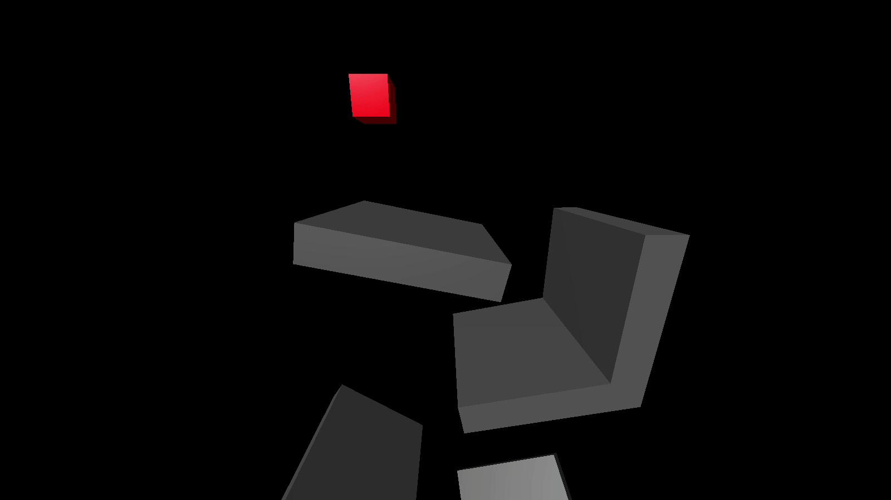

# 3D Soft Body Simulation

This simulation was created as the final project for CSCI 3010U "Simulation and Modelling" during the 2023 winter semester at Ontario Tech University. It features a deformable cube bouncing around between objects that were laid out to demonstrate the capabilities of the simulation, as shown in the above gif (which has a lower frame rate than the actual program due to the gif format). The graphics are rendered by OpenGL along with GLEW, GLFW, and GLM, while the rest of the code is entirely original.

The program features full camera control including rotation with the mouse, and multithreading to run the graphics and physics code in parallel, providing significant performance benefits and ensuring smooth, consistent camera control in the event that the simulation is unable to maintain real-time performance. On the simulation side, it utilizes the fourth order Runge-Kutta method for solving the ordinary differential equations controlling the system, and features robust collision detection with simulated friction when the soft body is in contact with a surface. The soft body dynamics are simulated through a mass-spring model with Hookean springs.

## Running
The program requires Windows 10 or higher to run. The compiled .exe file is located in the "build" folder of the repository along with the required .dll files. When running from a command line, 2 arguments can be specified for runtime options (which can be used in conjunction):
1. `-f`   - Enables full screen mode. Default mode uses an 840 x 840 window.
2. `-ups` - Enables the updates-per-second counter (see below for details). This can be toggled once the program is running regardless of whether this flag was specified, the flag just enables it at startup.

### Controls
| Input      | Action               |
| ---------- | -------------------- |
| W          | Move camera forward  |
| A          | Move camera left     |
| S          | Move camera backward |
| D          | Move camera right    |
| SPACE      | Move camera up       |
| LEFT SHIFT | Move camera down     |
| MOUSE      | Rotate camera        |
| ESC        | Close program        |
| F          | Toggle UPS counter   |

UPS counter = updates-per-second counter, which outputs the approximate number of simulation updates per second to the console once per second.

## Compiling
**Requires:**
* Windows 10 or higher
* MinGW g++
* MinGW make tool

The project can be compiled using the MinGW make tool from the root directory of the repository on the default target of the included makefile.
